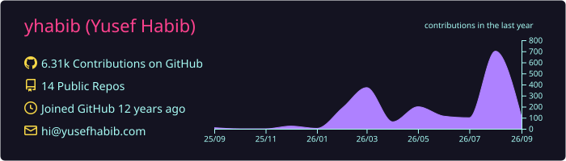
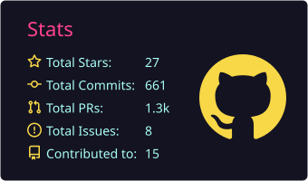
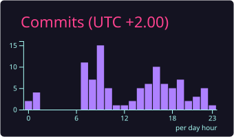

# Hi, I am Yusef 👋

I build web products and tools. I like the messy part where product decisions,
code, and real users meet.

I am a senior software engineer at [DFINITY](https://dfinity.org/). I work on
governance and sovereign cloud engines through
[Open Cloud](https://opencloud.org/).

## Selected work

- [Governance App](https://github.com/dfinity/governance-app) — a simpler
  interface for ICP staking, voting, delegation, accounts, and rewards.
- [NNS dapp](https://github.com/dfinity/nns-dapp) — the established application
  for ICP token management and Internet Computer governance.
- [Open Cloud Control Panel](https://github.com/dfinity/control-panel) — customer
  flows for creating and managing sovereign cloud engines.

## Independent projects

- [Claude Manager](https://github.com/yhabib/claude-manager) — a Rust terminal
  dashboard for monitoring and navigating Claude Code sessions.
- [Swiss German](https://github.com/yhabib/swiss-german-website) — the public
  website for an iOS app that teaches everyday Zurich German.

I work mainly with TypeScript, React, Svelte, Rust, and Go. I care about clear
interfaces, accessibility, engineering quality, and tools that remove repeated
work.

Learn more at [yusefhabib.com](https://yusefhabib.com/), or follow me on
[X](https://x.com/yhabibf).

